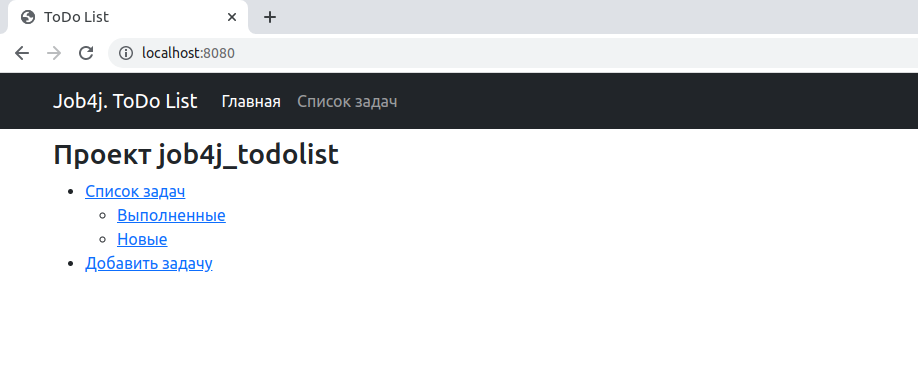
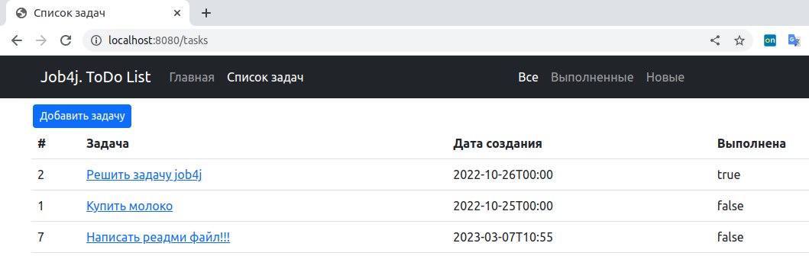
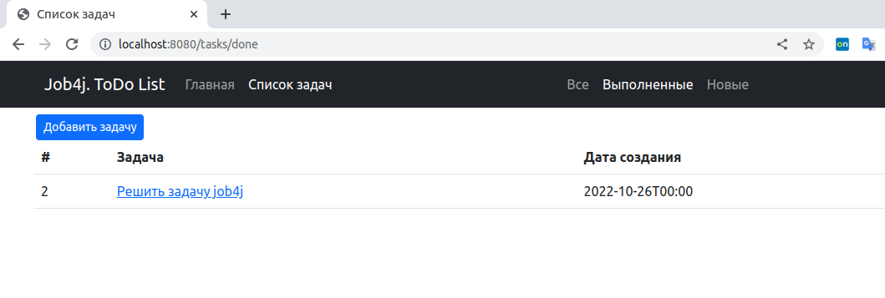
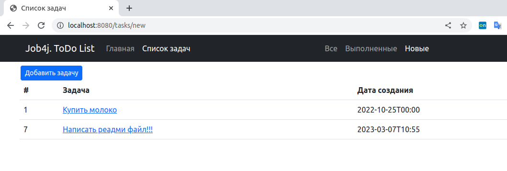
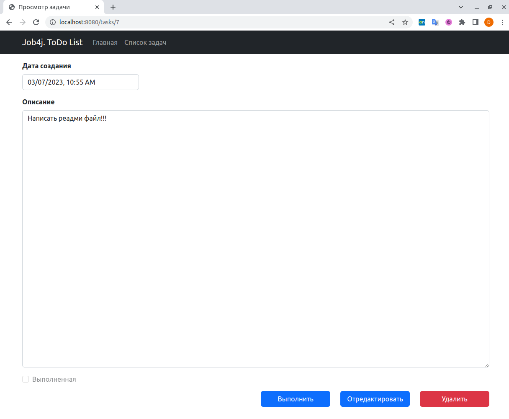

# job4j_todo

Курс от https://job4j.ru

#### Уровень "Middle"

---

## Веб-приложение для ведения списка задач.

#### Java 17, Spring boot 2, Thymeleaf 3, Bootstrap 5, Hibernate 5, PostgreSql 14

### Главное окно:
.

### Окно списка задач:
В окне списка задач можно осуществлять отбор по выполненным/новым задачам.

Все задачи:
.

Только выполненные:
.

Только новые:
.

### Окно подробного просмотра:

Из списка задач по ссылке описания задачи можно перейти к подробному представлению задачи:

.

По кнопкам ниже можно:
* `Выполнить` - перевести задачу в выполненные
* `Отредактировать` - перейти в режим редактирования задачи
* `Удалить` - безвозвратно удалить задачу

#### Контакты: her_vam@mail.ru
